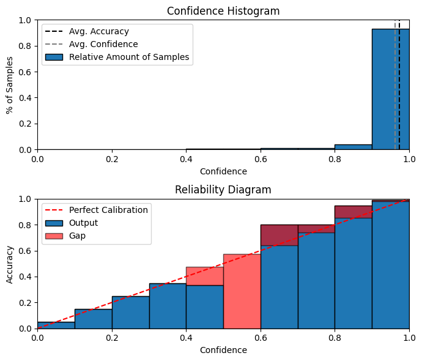
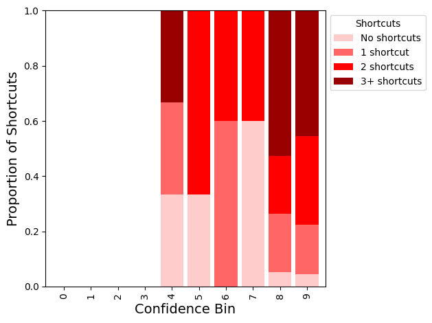

# The Reliability Paradox: Exploring How Shortcut Learning Undermines Language Model Calibration

This repository contains the code for the paper [_The Reliability Paradox: Exploring How Shortcut Learning Undermines Language Model Calibration_](https://arxiv.org/abs/2412.15269). 

## Abstract
The advent of pre-trained language models (PLMs) has enabled significant performance gains in the field of natural language processing. However, recent studies have found PLMs to suffer from miscalibration, indicating a lack of accuracy in the confidence estimates provided by these models. Current evaluation methods for PLM calibration often assume that lower calibration error estimates indicate more reliable predictions. However, fine-tuned PLMs often resort to shortcuts, leading to overconfident predictions that create the illusion of enhanced performance but lack generalizability in their decision rules. The relationship between PLM reliability, as measured by calibration error, and shortcut learning, has not been thoroughly explored thus far. This paper aims to investigate this relationship, studying whether lower calibration error implies reliable decision rules for a language model. Our findings reveal that models with seemingly superior calibration portray higher levels of non-generalizable decision rules. This challenges the prevailing notion that well-calibrated models are inherently reliable. Our study highlights the need to bridge the current gap between language model calibration and generalization objectives, urging the development of comprehensive frameworks to achieve truly robust and reliable language models.

---
### Shortcut learning vs calibration plots
<p>

</p>

<p>

</p>

---
### Setup
To begin, install the necessary dependencies:
```bash
pip install -r requirements.txt
```

### Usage Instructions

#### 1. **Fine-Tune a Pretrained Language Model**
To fine-tune a pre-trained language model and collect the necessary confidence scores and shortcut tokens for predictions, run the following command:
```bash
python ./src/train.py --data_name 'glue' --task_name 'sst2' --model_name 'bert'
```

**Arguments**:
- `--data_name`: The name of the dataset for fine-tuning the model. Supported datasets include: **GLUE**, **TREC**, **AG News**, and **TweetEval**.
- `--task_name`: The specific task within the dataset to train on. For **GLUE**, supported tasks are **SST-2** and **COLA**; for **TweetEval**, the tasks are **Emotion**, **Hate**, **Irony**, and **Sentiment**.
- `--model_name`: The identifier of the pre-trained model from Hugging Face to be used for fine-tuning. Supported models are: **BERT**, **ALBERT**, **BART**, **DeBERTa**, and **RoBERTa**.

This command generates the following outputs:
- **Prediction Probabilities**: The model’s confidence scores for each prediction.
- **Token-Level Attributions**: Attribution scores indicating the importance of each token in the prediction (e.g., computed using gradient-based methods).
- **Shortcut Tokens**: Tokens the model may rely on excessively, which could indicate shortcut learning.

#### 2. **Generate Reliability Diagrams and Shortcut Analysis**
Once the model has been fine-tuned and the results are generated, you can use the `plot_reliability.ipynb` notebook to analyze the calibration and shortcut token distributions.

---

#### Example Workflow

1. **Run `train.py`** to fine-tune a model and collect the results.
2. **Run `plot_reliability.ipynb`** to generate:
   - Reliability diagrams assessing calibration.
   - Stacked bar charts showing how shortcut learning behaviour is distributed across confidence levels.
---

### 🧠 Citation

If you find this work useful, please consider citing the following:

```bibtex
@inproceedings{bihani2024reliability,
  title={The Reliability Paradox: Exploring How Shortcut Learning Undermines Language Model Calibration},
  author={Bihani, Geetanjali and Rayz, Julia},
  journal={arXiv preprint arXiv:2412.15269},
  year={2024}
}
```
